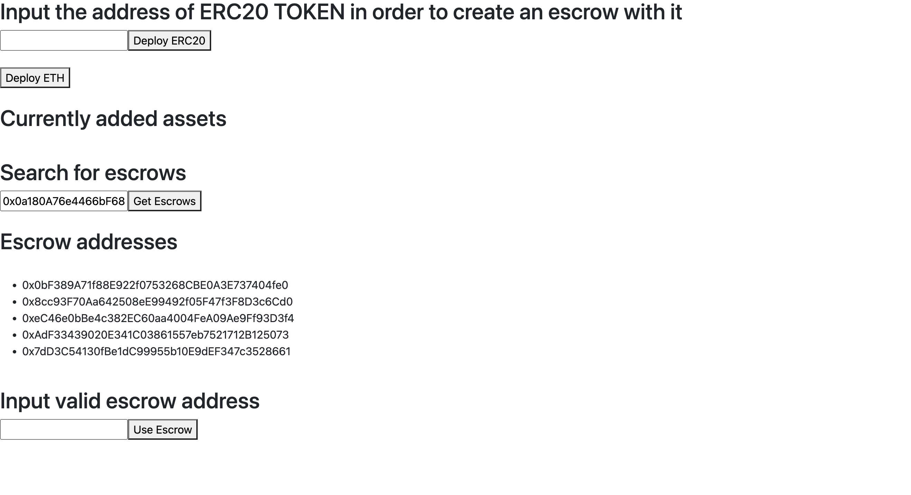
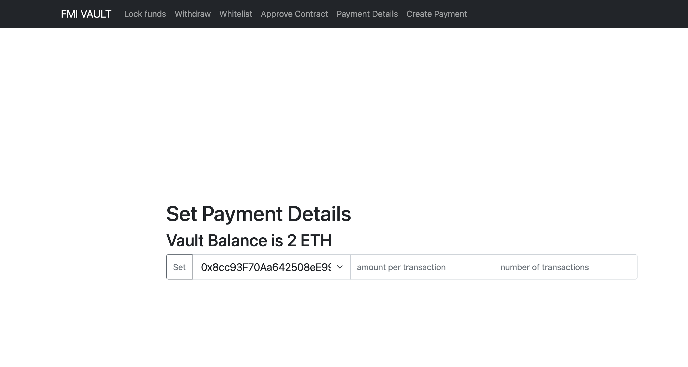
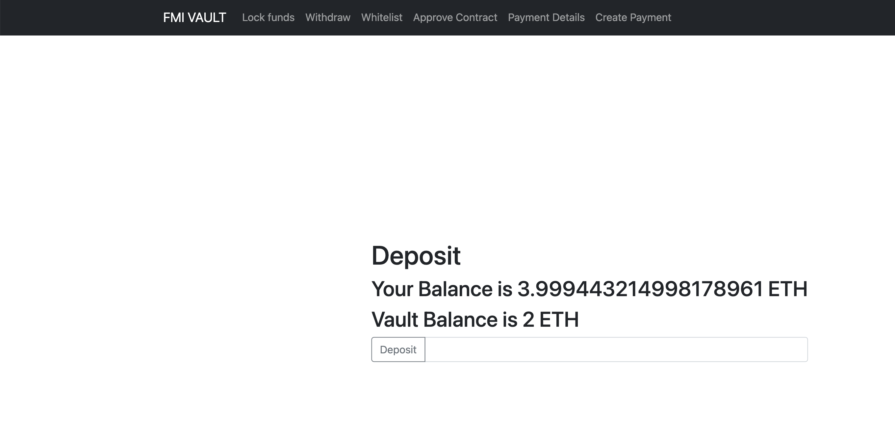

# Escrow Service

### Mihael Zlatev №: 45576
### Aneta Tsvetkova № 62634


## Contract address on the Ropsten test network

### VaultRegistry.sol

- Adress: 0x41A8a43504447fa6b13bc261090e86190a8838f4
https://ropsten.etherscan.io/address/0x2Cf410f2CBD7305490c90BF334260664b50038B4
- ABI: https://github.com/mishozz/fmi-blockchain-vault/blob/main/main/src/abis/Registry.json

### VaultETH.sol

There are many escrow services which are working with ETH. Below is only one of them.

- Adress: 0x8cc93F70Aa642508eE99492f05F47f3F8D3c6Cd0
https://ropsten.etherscan.io/address/0x8cc93F70Aa642508eE99492f05F47f3F8D3c6Cd0
- ABI: https://github.com/mishozz/fmi-blockchain-vault/blob/main/main/src/abis/VaultETH.json

### VaultERC20.sol

There are many escrow services which are working with ERC20. Below is escrow service which is working with the token DAI.

- Adress: 0xCEAd1Bdd123434fF3aff6af64f55f5F09551196e
https://ropsten.etherscan.io/address/0xCEAd1Bdd123434fF3aff6af64f55f5F09551196e
- ABI: https://github.com/mishozz/fmi-blockchain-vault/blob/main/main/src/abis/VaultERC20.json

### Escrow Summary 

Escrow Service is smart contract which stores and automates payments without the need of third parties.
It ensures that the terms of the transaction agreed upon by both the Owner and Receiver are satisfied.
The parties involved in the transaction need to ensure that both the agreed product/service is delivered and payment is made. One party should not be able to default the transaction at the expense of the other party.

## Escrow Registry Workflow


## Escrow Service Workflow


## Contract's Details

## VaultCore / VaultERC20 / VaultETH

## State fields

```
bool public contractSigned;
bool public hasOwnerSigned;
uint256 public whiteListLength;
uint256 public currentAmount;
address[] public whitelist;


struct Payment {
    uint256 amount;
    uint256 numberOfTransactions;
}

struct Reciever {
    bool isWhiteListed;
    bool hasSigned;
}

mapping(address => Reciever) public receivers;
mapping(address => Payment) public paymentDetails;
```

## Functions

```
/**
* Every address from the input is getting whitelisted 
*
* @param  _whitelist  array with adresses that will be whitelisted
*/
function setWhitelistAddresses(address[] memory _whitelist)
```

```
/**
* Reciever signs the contract
*
* @param  none
*/
function receiverApprove()
```

```
/**
* Owner of the funds signs the contract
*
* @param  none
*/
function ownerApprove()
```

```
/**
* Checks whether the contract is signed
*
* @param  none
* @return bool
*/
function isContractSigned() returns (bool)
```

```
/**
* Deposit the amount of Wei sent with the transaction in the contract.
*
* @param  none
*/
function deposit()
```

```
/**
* Withdraw the deposited amount to the Owner's address only if the contract is not signed
*
* @param  none
*/
function withdraw()
```

```
/**
* Set the recievers. Set the amount that should be reciever and the number of transactions that should be executed.
* The method checks whether there is enough deposited ETH in order to satisfy the payment details.
*
* @param  _reciver the address who will recieve future payment
* @param  _amount payment amount
* @param  _numberOfTransactions how many transactions can be executed
*
*/
function setPaymentDetails(address _reciever, uint256 _amount, uint256 _numberOfTransactions)
```

```
/**
* The receiver will recieve the already set payment amount
* Payment is executed only if there are enough funds deposited.
*
* @param  _reciever  the address which recieves the payment
*/
function createPaymentTo(address _reciever)
```

```
/**
* Every whitelisted address receive the already set payment amount
* Payment is executed only if there are enough funds deposited.
*
* @param  none
*/
function createPaymentToAll()
```

## Method calls examples

- NOTE: Vault is the same as Escrow Service

The following example are using the web3 sdk for Javascript.

 - vault = new web3.eth.Contract(Vault.abi, vaultData.address)

### Deposit
```
vault.methods.deposit()
            .send({from: "0x1aD91ee08f21bE3dE0BA2ba6918E714dA6B45836", value: 10000 Wei})
```

### Withdraw 
```
vault.methods.withdraw()
            .send({from: "0x1aD91ee08f21bE3dE0BA2ba6918E714dA6B45836"})
```

### SetPaymentDetails
```
vault.methods.setPaymentDetails("0x71C7656EC7ab88b098defB751B7401B5f6d8976F", 10000 Wei, 3)
            .send({from: "0x1aD91ee08f21bE3dE0BA2ba6918E714dA6B45836"})
```

### CreatePaymentTo
```
vault.methods.createPaymentTo("0x71C7656EC7ab88b098defB751B7401B5f6d8976F")
            .send({from: "0x1aD91ee08f21bE3dE0BA2ba6918E714dA6B45836"})
```

### OwnerApprove
```
vault.methods.ownerApprove()    
            .send({ from: "0x1aD91ee08f21bE3dE0BA2ba6918E714dA6B45836"}) 
```

### ReceiverApprove
```
vault.methods.receiverApprove()
            .send({ from: "0x1aD91ee08f21bE3dE0BA2ba6918E714dA6B45836" })
```

### SetWhitelistAddresses
```
vault.methods.setWhitelistAddresses(["0x1aD91ee08f21bE3dE0BA2ba6918E714dA6B45836", "0x71C7656EC7ab88b098defB751B7401B5f6d8976F"])
            .send({from: "0x3EcEf08D0e2DaD803847E052249bb4F8bFf2D5bB"})
```

## VaultRegistry

```
    address public override vaultFactory;
    address public override vaultETHFactory;
    address public override WETH;
    address[] public override assets;
    mapping(address => address[]) public vaultsPerAsset;
```

## Functions

- NOTE: Vault is the same as Escrow Service

```
/**
* Creates vault which works with Ether
* @param  none
*/
function createVaultETH()
```

```
/**
* Creates vault which works with the ERC20 token
*
* @param  asset address of the ERC20 token
*/
function createVault(address asset)
```

```
/**
* Returns all deployed vaults which are working with the provided asset
*
* @param  asset address of the ERC20 token or the Ether token
*
* @return returns all deployed vault working with the asset
*/
function getVaultsPerAsset(address asset)
```

## Method calls examples

### createVaultETH

```
vaultRegistry.methods.createVaultETH()
            .send({from: account})
```

### createVault

```
vaultRegistry.methods.createVault(asset)
            .send({from: account})
```

### getVaultsPerAsset

```
vaultRegistry.methods.getVaultsPerAsset(address).call();
```

## Used Frameworks and Tools

- Hardhat
- Chai
- React

## Demo

 - https://unisofiafaculty-my.sharepoint.com/:u:/g/personal/aipanajoto_office365faculty_uni-sofia_bg/EXoDzS9Mc15NmvU8F8rytOwBHMUev2un9ZKirJNGi553Vg?e=g1MstW


 ### UI

 
 
 

## Local developement

**Requirments**

**npm** (Node package manager) must be installed


- Install react

`npm i react`

`npm install`

`react-router-dom`

- Install Metamask in your browser

**How to run**

- Connect your metamask on the Ropsten network.

- In the `main` folder run

`npm start`


## Run Tests

`npx hardhat test`
