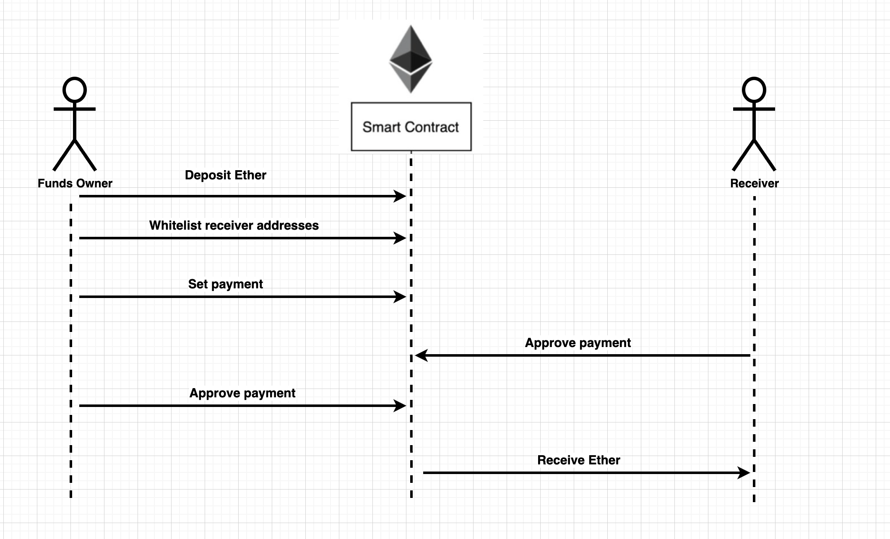

# Escrow Service

## Local developement

**Requirments**

**npm** (Node package manager) must be installed

- Install truffle

`npm install -g truffle` 

- Install ganache cli or install Ganache GUI - https://trufflesuite.com/ganache/

`npm install -g ganache-cli`

- Install react

`npm i react`

`npm install react-bootstrap bootstrap@5.1.3`

`react-router-dom`

- Install Metamask in your browser

**How to run**
- Connect to Ganache
- In the project folder deploy the smart contract: 

`truffle init`

`truffle migrate`

- Connect your metamask to the local Ganache blockchain.

- Connect an Address from your Ganache to Metamask

- In the `main` folder run

`cd main`

`npm start`

## Run Tests

`truffle test`

## Overview

Escrow Service is smart contract which stores and automates payments without the need of third parties. Operating on the Etherium network gives the Escrow Service security and transparency. The contract can be used non formally by two parties when they don't trust each other.

### Escrow Service Workflow

**The workflow has 5 steps:**
- 1. Owner locks funds in the escrow service.
- 2. Owner whitelists the recieving wallets adresses.
- 3. Owner sets the payment schedule
- 4. The recieving wallets must authorize the payment.
- 5. Owner finally signs the contract

**Payment Features**

Before signing the smart contract by both parties **numberOfTransactions** and **amount**. Each recieving wallet address can have unique number of transactions and value per transaction. The maximum number of trasactions to each wallet are equal to the number of funds locked in the Escrow Service devided by the number or transaction.

For example 1000 USDT are locked. "Wallet A" can recieve max 1000 USDT at once or every Monday 100 USDT. That means the maximum number of transactions to this wallet are **1000 / 100 = 10**.

Another scenario is 1000 USDT locked, "Wallet A" sets 100 USDT for 5 weeks to be sent it. That leaves 500 USDT for the other whitelisted wallets. 

After the contract is signed. There are two possibilities to make payments.

- **createPaymentTo** sends the preconfigured amount of funds to the provided address. The address must have been whitelisted.
- **createPaymentToAll** sends the precofigured amount of funds to all whitelisted addresses.

For both payment strategies the code checks that enough funds are locked in order to execute the transaction. Also if the number of transactions left is less than 1 no transaction is being executed.

**Security Features**

Since the contract is immutable after it's in play it must be signed by **All* whitelisted wallets and the owner of the funds as well. Multisigature can be used to sign the contract from the owner address.

- Only the owner of the contract can lock value and only the owner can withdraw the locked value to him self.
- Only whitelisted addresses can recieve funds.
- Only the owner and the whitelisted addresses can sign the contract
